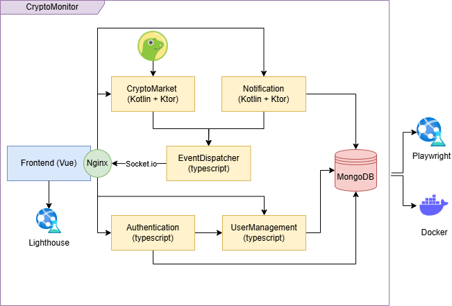

== Architecture Design

After the analysis of the domain and the production of the bounded context, the next step that the team followed was the design of the architecture.

=== Application Design
For the CryptoMonitor system, the team chose a microservices architecture. The microservices architecture is an architectural style that structures an application as a collection
of services that are loosely coupled, highly maintainable, and independently deployable. Each service is responsible for a specific business capability and can be developed, deployed,
and scaled independently.

The system has been devided into the following microservices following the bounded context:

* *Vue-frontend microservice*: This microservice is responsible for the user interface of the system. It is a Vue.js application that consumes the RESTful APIs provided by the backend microservices.
* *Authentication microservice*: This microservice is responsible for the authentication and authorization of the users of the system. It provides the necessary APIs for user registration, login, and token generation.
* *Crypto Market microservice*: This microservice is responsible for fetching the latest cryptocurrency market data from the CoinGecko API and storing it in the database. It provides the necessary APIs for fetching the market data.
* *User Management microservice*: This microservice is responsible for managing the user of the system including his account, watchlist e wallet. It provides the necessary APIs for user management like viewing and editing the account, adding and removing cryptos for the watchlist
and adding and removing transactions for the wallet.
* *Notification microservice*: This microservice is responsible for sending notifications to the users of the system based on the price alterts that they have set. It provides the necessary APIs for handling the notifications and setting the price alerts.
* *Event-dispatcher microservice*: This microservice has been added to the architecture to handle the communication between the microservices. More specifically, it is responsible for dispatching events between the Vue-frontend and Crypto Market and Notification microservices.

The *Vue-frontend* and the *Event-dispatcher* microservices doesn't appier in the bounded context analysis. The first-one because is dedicated only to the frontend and the second-one because is a simple orchestrator between the frontend and the other microservices.
However, the team decided to include them in the architecture as a microservices to have a more clear and complete view of the system and also to permit the scalability of the entire system.

The architecture of the system is shown in the following diagram:

=== Interactions
Each microservice interacts with the others through RESTful APIs. The Vue-frontend microservices also use WebSockets(Socket.io) to communicate with the event-dispatcher microservice to receive real-time data.

The team decided to not use an API Gateway in the architecture to avoid unecessary complecity and to keep the system as simple as possible.

=== Microservices Design
For each microservice, the team adopted an hexagonal architecture, except for the Vue-frontend microservice that is a Single-Page Application (SPA).
The hexagonal architecture is an architectural style that separates the application into three main layers:

* Domain layer: This layer contains the business logic of the application. It is the core of the application and is independent of the other layers.
* Application layer: This layer contains the use cases of the application. It is responsible for coordinating the interactions between the domain layer and the infrastructure layer.
* Infrastructure layer: This layer contains the implementation details of the application. It is responsible for interacting with external systems such as databases, APIs, and messaging systems.

In the following sections is provided a detailed description of all the microservices and their hexagonal architecture.

==== Authentication
The Authentication microservice is responsible for the authentication and authorization of the users of the system. It provides the necessary APIs for user registration, login, and token handling.
The project structure is shown in the following diagram:
[plantuml, {diagramsdir}/packagediagramauth, svg, title="Package Diagram - Authentication Microservice"]
----
!include resources/puml/packagediagrams/authpackage.puml
----
* The business logic of the Authentication microservice is contained in the domain layer, composed by the models prevously identified and the ports.

* The application layer contains the use cases of the microservice, like the registration and login use cases and orchestrates the interactions between the domain layer and the infrastructure layer.

* The infrastructure layer is responsible for the interaction with the database and the JWT token generation. In this layer there are the APIs exposed to the other microservices.

==== Crypto Market
The Crypto Market microservice is responsible for fetching the latest cryptocurrency market data from the CoinGecko API. It provides the necessary APIs for fetching the market data.
The project structure is shown in the following diagram:

[plantuml, {diagramsdir}/packagediagramcryptomarket, svg, title="Package Diagram - Crypto Market Microservice"]
----
!include resources/puml/packagediagrams/cryptomarketpackage.puml
----

* The business logic of the Cryptomarket microservice is contained in the domain layer. This layer is composed of market entity models previously identified and ports.

* The application layer implements business rules like retrieving market data and managing fetch processes. Orchestrates interactions between the domain and infrastructure layers.

* The infrastructure layer is responsible for interacting with external systems, such as the CoinGecko API for data retrieval and event handling. Contains adapters for external communication.
Components include CryptoRepositoryImpl (for HTTP communication), EventDispatcherAdapter (for event publishing), and a WebServer (for exposing RESTful endpoints).

==== Event-dispatcher
The Event-dispatcher microservice is responsible for handling the communication between the microservices. It is responsible for dispatching events between the Vue-frontend and Crypto Market and Notification microservices.
The project structure is shown in the following diagram:
[plantuml, {diagramsdir}/packagediagrameventdispatcher, svg, title="Package Diagram - Event-dispatcher Microservice"]
----
!include resources/puml/packagediagrams/eventdispatcherpackage.puml
----

* The business logic of the Event-dispatcher microservice is contained in the domain layer. This layer is composed of ports and several models that represent the events that are dispatched between the microservices.
* The application layer implements business rules like processing events and validating data. Orchestrates interactions between the domain and infrastructure layers.
* The infrastructure layer is responsible for interacting with external systems, including adapters for WebSockets, event-handling and JWT token validation. Exposes his APIs in the EventAdapter.

==== Notification
The Notification microservice is responsible for sending notifications to the users of the system based on the price alerts that they have set. It provides the necessary APIs for handling the notifications and setting the price alerts.
The project structure is shown in the following diagram:
[plantuml, {diagramsdir}/packagediagramnotification, svg, title="Package Diagram - Notification Microservice"]
----
!include resources/puml/packagediagrams/notificationpackage.puml
----

* The business logic of the Notification microservice is contained in the domain layer. This layer is composed of notification entity models previously identified and ports.
* The application layer implements business rules like sending notifications and managing alerts. Orchestrates interactions between the domain and infrastructure layers.
* The infrastructure layer is responsible for interacting with external systems, including an adapters for DB and event-dispatcher and for validate the JWT token given that the notifications interest only the logged user. Exposes his APIs with a WebServer.

==== User Management
The User Management microservice is responsible for managing the users of the system including their account, watchlist, and wallet. It provides the necessary APIs for user management like viewing and editing the account, adding and removing cryptos for the watchlist, and adding and removing transactions for the wallet.

[plantuml, {diagramsdir}/packagediagramusermanagement, svg, title="Package Diagram - User Management Microservice"]
----
!include resources/puml/packagediagrams/usermanagementpackage.puml
----

* The business logic of the User Management microservice is contained in the domain layer. This layer is composed of user entity models previously identified, ports and a factory responsible for creating new User entities along with their associated Wallet and Watchlist.
* The application layer implements business rules like managing user accounts, watchlists, and wallets using the commands identified in the DDD. Orchestrates interactions between the domain and infrastructure layers.
* The infrastructure layer is responsible for interacting with external systems, including adapters for DB communication and APIs exposition of user account, wallet and watchlist. Include also an adapter for the JWT token validation and a middleware to protect the routes reserved to the logged user.
