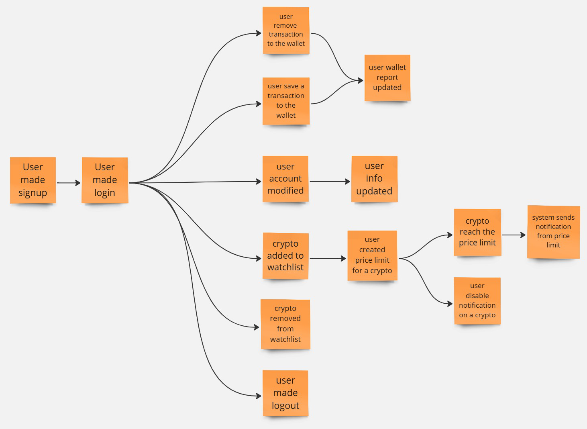
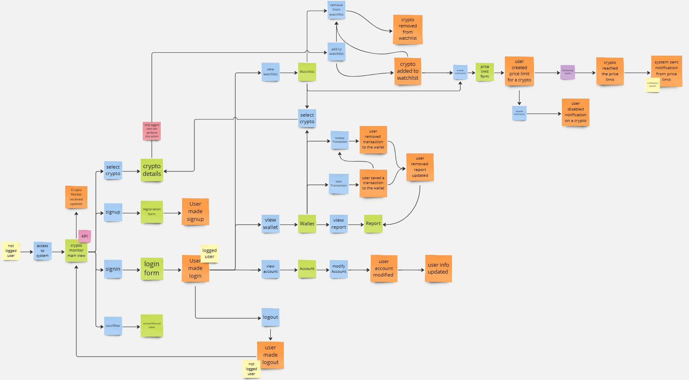
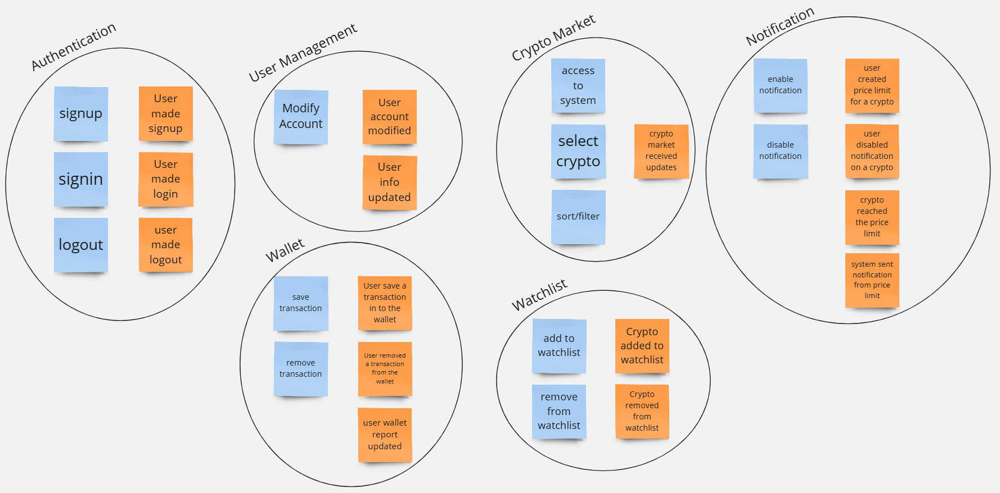
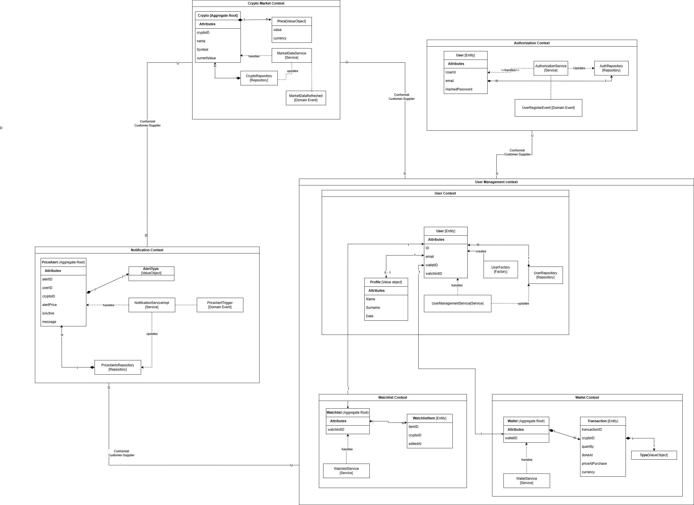

== Domain Driven Design
The first step in the development of the system has been to understand the domain in which the application will operate.
The Domain name identified is CryptoMonitor, composed of the two words Crypto, so Cryptocurrencies and
Monitor that stands for the verb Monitoring. So, the domain is about Monitoring Cryptocurrencies.
//example how to correctly import a plantuml diagram
// [plantuml, {diagramsdir}/usecaseauth, svg]
// ----
// !include resources/puml/usecase/usecase-auth.puml
// ----

=== Ubiquitous Language
Once identified the domain name, the next step has been to define the Ubiquitous Language used by the team.
In this phase, the key concepts related to the domain under analysis are identified. Subsequently, a glossary of terms
and their definitions is created, establishing a shared language for all project stakeholders.

[cols="1,2"]
|===
| Term | Definition

| *System*
| The application that gives access and functionality to not-logged users and logged users.

| *Application*
| A tool accessible via the web.

| *Not-Logged User*
| A user who didn’t register to the system.

| *Logged User*
| A user registered to the system that can access additional functionality, like having a personal wallet and a watchlist.

| *User*
| A person that uses the application.

| *Account*
| A set of data related to a user.

| *Authentication*
| A process where a not-logged user can become a logged user using their credentials.

| *Credentials*
| A pair of email and password that identify an account.

| *Wallet*
| A list of crypto assets that the logged user owns.

| *WatchList*
| A list of cryptos that the logged user decided to observe.

| *Crypto Asset*
| A set of data (buying price/date, selling price/date, quantity) related to a crypto that the user owns.

| *Crypto Details*
| A set of data related to a crypto (name, symbol, price, market cap, 24h volume, price variation).

| *Notification*
| A message from the system sent to a logged user related to a crypto in their watchlist.

| *Crypto*
| A cryptocurrency.

| *Report*
| An analysis of the wallet of a logged user during a timespan.

| *Performance*
| The overall value trend of the wallet based on historical crypto prices, considering any purchase or sale operations.

| *Interactive Chart*
| A visual representation that allows users to analyze historical cryptocurrency or wallet data with interactive features such as zoom, time filters, and customizable views.

| *FIAT Currency*
| A traditional currency used to compare the market value of cryptocurrencies (EUR, USD, etc.).

| *Price Variation*
| Fluctuation in a crypto’s value.

| *24h Volume*
| The total trading value of a cryptocurrency over the last 24 hours.

| *Market Cap*
| The total value of a cryptocurrency, calculated by multiplying its current price by the total circulating supply.

| *Transaction*
| A movement of a crypto related to the wallet. It can be a purchase or a sale and is used to track the asset.

| *Crypto Market*
| A set of the most important cryptocurrencies.

| *Price Limits*
| A threshold on the price of a crypto.

|===

=== Requirements Analysis
Here are listed the requirements identified during the analysis phase. They are divided into system, business and functional requirements.
To enforce the analysis, the requirements are also linked to the use cases and user stories, providing also a detail description of them.

==== _System Requirements_
1. The system has to provide login, registration, and logout in a safe way.
2. The system has to provide a page to see the info related to the account.
3. The system has to allow the user to edit the info related to the account.
4. The system has to allow the user to monitor the crypto market.
5. The system has to allow the user to see a detail for each crypto.
6. The system has to allow the logged user to access his wallet and see reports of its historic performance.
7. The system has to allow the logged user to add and remove transactions in the wallet.
8. The system has to allow the logged user to access his watchlist.
9. The system has to allow the logged user to add or remove cryptos to his watchlist.
10. The system has to allow the logged user to set price limits on the cryptos present in the watchlist that can trigger notifications when they’re crossed.
11. The system has to allow all the users to visualize the crypto’s prices in different FIAT values.

==== _Business Requirements_
1. The system must allow all users to monitor the cryptocurrency market in real-time.
2. The system must allow users to access detailed information about each cryptocurrency.
3. The system must provide logged-in users with tools to manage a personal wallet and analyze its historical performance.
4. The system must notify logged-in users of significant price changes or configured limits.

==== _Functional Requirements_
1. The system must provide secure registration, login and logout functionalities.
2. The system must provide a page to visualise the account.
3. The system must allow users to edit the information related to the account.
4. The system must display cryptocurrency prices in different FIAT currencies (e.g., EUR, USD).
5. The system must allow users to view details about cryptocurrencies, including:
** The symbol and name of the cryptocurrency.
** The price in FIAT currencies.
** Price variations over a specified timespan.
6. The system must allow users to filter and sort the crypto market.
7. The system must allow logged-in users to:
** Access their wallet.
** Add and remove transactions in the wallet.
** View reports of the wallet’s historical performance.
8. The system must allow logged-in users to:
** Access their watchlist
** Add and remove cryptocurrencies from their watchlist.
** Configure price limits on cryptocurrencies in the watchlist.
9. The system must generate notifications when configured price limits are crossed.

==== _Use Cases and User stories: Authentication_
[plantuml, {diagramsdir}/usecaseauth, svg, title="Use Case Diagram: Authentication"]
----
!include resources/puml/usecase/usecase-auth.puml
----
* *US1: Registration*

    As a not-logged user,
    I want to register an account
    so that I can access the system's features.

[cols="1,1"]
|===

| *Actors*
| Not logged user

| *Precondition*
| User is not registered to the system

| *Postcondition*
| User is registered to the system

| *Trigger*
| User clicks on the sign-up button

| *Acceptance Criteria*
|
- The user must be able to access the registration page.

- The registration form must validate inputs (e.g., email format, password strength).

- The system should display an error message for invalid or duplicate emails.

- On successful registration, the user is redirected to the login page.

| *Exceptions*
|
- Invalid email format.

- Weak password.

- Duplicate email.
|===

* *US2: Login*

    As a not-logged user
    I want to authenticate into an account
    so that i can access to my private data

[cols="1,1"]
|===

| *Actors*
| Not logged user

| *Precondition*
| User is not logged into the system

| *Postcondition*
| User is logged into the system

| *Trigger*
| User clicks on the sign-in button

| *Acceptance Criteria*
|
- The user must be able to access the login page.

- The system should display an error message for invalid credentials.

- On successful authentication, the user is redirected to the account page.

| *Exceptions*
|
- Invalid credentials.
|===

* *US3: Logout*

    As a logged user
    I want to log out of my account
    so that i can securely end my session.

[cols="1,1"]
|===

| *Actors*
| Logged user

| *Precondition*
| User is logged into the system

| *Postcondition*
| User is not logged into the system

| *Trigger*
| User clicks on the logout button

| *Acceptance Criteria*
|
- The user can log out from the account page.

- After logout, the user is redirected to the homepage.
|===

==== _Use Cases and User stories: Generic_
[plantuml, {diagramsdir}/usecasegeneric, svg, title="Use Case Diagram: Generic"]
----
!include resources/puml/usecase/usecase-generic.puml
----

* *US4: View Account*

    As a logged user
    I want to see details of my account
    so that i can see my information and logout.

[cols="1,1"]
|===

| *Actors*
| Logged user

| *Precondition*
| User is logged into the system

| *Postcondition*
| User can see details of his account

| *Trigger*
| User clicks on the account detail button

| *Acceptance Criteria*
|
- The user can see his info on the account page.

- If the system is not working, an error message is shown.

| *Exceptions*
|
- The system is down.
|===

* *US5: Edit Account*

    As a logged user
    I want to edit my account information
    so that I can update my personal data.

[cols="1,1"]
|===

| *Actors*
| Logged user

| *Precondition*
| User is on the account page

| *Postcondition*
| User account information is updated

| *Trigger*
| User clicks on the edit account button

| *Acceptance Criteria*
|
- The system displays the form to edit the account’s fields.

- The user edits his account’s fields.

- If the system is not working, an error message is shown.

- If the edit is not successful, an error message is shown.

| *Exceptions*
|
- The system is down.
|===

* *US6: Monitor Crypto Market*

    As a user (both logged and not logged),
    I want to access the homepage,
    So that I can monitor the cryptocurrency market.

[cols="1,1"]
|===

| *Actors*
| Logged user, Not logged user

| *Precondition*
| User can access the system

| *Postcondition*
| User can access the homepage

| *Trigger*
| The user presses the home button or accesses the system

| *Acceptance Criteria*
|
- The homepage displays information about cryptocurrencies.

- If the system is not working, an error message is shown.

| *Exceptions*
|
- The system is down.

| *Technical Details*
|
- Display the symbol, name, and price of each cryptocurrency.

- Show prices in FIAT currency.

- Include price variation within a specific timespan (24h volume), the market cap.

- Allow filtering and sorting on the market.
|===

* *US7: Watch a Crypto*

    As a user (both logged and not logged),
    I want to access the crypto details,,
    So that I can monitor the specific crypto.

[cols="1,1"]
|===

| *Actors*
| Logged user, Not logged user

| *Precondition*
| User can access the system

| *Postcondition*
| User can access the detail page

| *Trigger*
| User clicks on a crypto in the list

| *Acceptance Criteria*
|
- If the system is down, an error message should indicate the issue.

- The page displays information about the selected crypto.

| *Exceptions*
|
- API issue

| *Technical Details*
|
- Display the symbol, name of each cryptocurrency and the chart.

- Show prices in FIAT currency.

- Include Circulating Supply, Max Supply, All Time High, All Time High Change, Useful Links, and Community Sentiment.
|===

* *US8: Access Wallet*

    As a logged user,
    I want to access my wallet,
    So that I can monitor my wallet history and value.

[cols="1,1"]
|===

| *Actors*
| Logged user

| *Precondition*
| User is logged into the system

| *Postcondition*
| User can access the wallet page

| *Trigger*
| User clicks on the wallet button

| *Acceptance Criteria*
|
- The page displays information about the wallet.

- If the system is down, an error message should indicate the issue.

| *Exceptions*
|
- API issue.
|===

[cols="1,1"]
|===

| *Actors*
| Logged user

| *Precondition*
| The user is in the wallet page

| *Postcondition*
| The wallet performance report is displayed

| *Trigger*
| User clicks on the report button

| *Acceptance Criteria*
|
- The page displays information about the wallet performance.

- If the system is down, an error message should indicate the issue.

| *Exceptions*
|
- API issue.
|===

* *US9: Manage Transaction*

    As a logged user,
    I want to add/remove transactions into my wallet,
    So that I can keep track of my owned crypto and update the wallet history.

[cols="1,1"]
|===

| *Actors*
| Logged user

| *Precondition*
| User is in the wallet page

| *Postcondition*
| The transaction is saved in the system

| *Trigger*
| User clicks on the save transaction button

| *Acceptance Criteria*
|
- The user can see if the transaction succeeded.

- If the system is down, an error message should indicate the issue.

| *Exceptions*
|
- The system is down.
|===

[cols="1,1"]
|===

| *Actors*
| Logged user

| *Precondition*
| User is in the wallet page and the transaction is shown in the wallet

| *Postcondition*
| The transaction is removed from the system

| *Trigger*
| User clicks on the remove transaction button

| *Acceptance Criteria*
|
- The user can see if the transaction removal succeeded.

- If the system is down, an error message should indicate the issue.

| *Exceptions*
|
- The system is down.
|===

* *US10: Access Watchlist*

    As a logged user,
    I want to access to my watchlist,
    So that I can manage my preferred cryptos.

[cols="1,1"]
|===

| *Actors*
| Logged user

| *Precondition*
| User is logged into the system

| *Postcondition*
| User can access the watchlist page

| *Trigger*
| User clicks on the watchlist button

| *Acceptance Criteria*
|
- The page displays all the crypto added to the watchlist.

- If the system is down, an error message should indicate the issue.

| *Exceptions*
|
- API issue.
|===

* *US11: Add Crypto to Watchlist*

    As a logged user,
    I want to add/remove cryptos to my watchlist,
    So that I can monitor the preferred cryptos.

[cols="1,1"]
|===

| *Actors*
| Logged user

| *Precondition*
| User is on the crypto detail page

| *Postcondition*
| The crypto is added to the watchlist

| *Trigger*
| User clicks on the “add to watchlist” button

| *Acceptance Criteria*
|
- The user knows if the add was successful.

- The crypto is shown in the watchlist page.

- If the system is down, an error message should indicate the issue.

| *Exceptions*
|
- API issue.
|===

* *US12: Remove Crypto from Watchlist*

    As a logged user,
    I want to remove cryptos from my watchlist,
    So that I can manage the preferred cryptos.

[cols="1,1"]
|===

| *Actors*
| Logged user

| *Precondition*
| User is on the watchlist page and the crypto is in the watchlist

| *Postcondition*
| The crypto is removed from the watchlist

| *Trigger*
| User clicks on the “Delete” button on the crypto row

| *Acceptance Criteria*
|
- The user knows if the removal was successful.

- The crypto is not shown anymore in the watchlist page.

- If the system is down, an error message should indicate the issue.

| *Exceptions*
|
- API issue.
|===

==== _Use Cases and User stories: Notification_
[plantuml, {diagramsdir}/usecasenotification, svg, title="Use Case Diagram: Notification"]
----
!include resources/puml/usecase/usecase-notification.puml
----

* *US13: Create/Delete notification from watchlist*

    As a logged user
    I want to create/delete notification from my watchlist,
    So that I can keep track of the price of my watched cryptos

[cols="1,1"]
|===

| *Actors*
| Logged user, Notification system

| *Precondition*
| User is in the watchlist page

| *Postcondition*
| The notification is created for the crypto

| *Trigger*
| User clicks on the “enable notification” button and completes the form

| *Acceptance Criteria*
|
- The notification system starts monitoring the price.

- If an error occurs, the system notifies the user.

| *Exceptions*
|
- API issue

| *Technical Details*
|
- The user can add a threshold price for a crypto.
|===

[cols="1,1"]
|===

| *Actors*
| Logged user, Notification System

| *Precondition*
| User is in the watchlist page, and the user goes to the notification list

| *Postcondition*
| The notification is deleted for the crypto

| *Trigger*
| User clicks on the “delete notification” button on a notification

| *Acceptance Criteria*
|
- The notification system stops monitoring the crypto.

- If an error occurs, the system notifies the user.

| *Exceptions*
|
- API issue
|===

* *US14: Enable/Disable notification*

    As a logged user
    I want to enable/disable notification from my watchlist,
    So that I can manage the notifications of my watched cryptos

[cols="1,1"]
|===

| *Actors*
| Logged user, Notification system

| *Precondition*
| User is in the watchlist page

| *Postcondition*
| The notification is enabled for the crypto

| *Trigger*
| User uses the active switch and sets it to active

| *Acceptance Criteria*
|
- The notification system starts monitoring the price.

- If an error occurs, the system notifies the user.

| *Exceptions*
|
- API issue
|===

[cols="1,1"]
|===

| *Actors*
| Logged user, Notification system

| *Precondition*
| User is in the watchlist page

| *Postcondition*
| The notification is disabled for the crypto

| *Trigger*
| User uses the active switch and sets it to inactive

| *Acceptance Criteria*
|
- The notification system stops monitoring the price.

- If an error occurs, the system notifies the user.

| *Exceptions*
|
- API issue
|===

* *US15: Receive notification*

    As a logged user
    I want to receive notifications from the system,
    So that I can be informed about the price of my watched cryptos

[cols="1,1"]
|===

| *Actors*
| Notification System, Logged User

| *Precondition*
| Notification is active for a crypto

| *Postcondition*
| The logged user is notified

| *Trigger*
| The monitored crypto reaches the price limit

| *Acceptance Criteria*
|
- A notification is sent to the user.

| *Exceptions*
|
- API issue
|===

* *US16: Monitor Crypto Price*

        As a logged user
        I want to monitor the price of a crypto,
        So that I can be informed about the price of my watched cryptos

[cols="1,1"]
|===
| *Actors*
| Notification System, Logged user
| *Precondition*
| Notification is active for a crypto
| *Postcondition*
| The Notification System monitors the price of the crypto
| *Trigger*
| User sets a price limit for a crypto
| *Acceptance Criteria*
| - The Notification System monitors the price of the crypto
| *Exceptions*
| - API issue
|===

=== Event Storming
The knowledge crunching session was conducted using the Event Storming approach, that facilitates collaboration between developers
and domain experts to explore and define the project's domain. By utilizing color-coded sticky notes, the team iteratively identifies key elements,
including actors, domain events, commands and views/read models, ensuring a comprehensive understanding of the system's behavior and requirements.
The steps followed during the Event Storming session are described as follows, until to the production of the context map.

==== _Step 1: Identify Domain Events_
Here are the domain events that can happen in the system identified during the Event Storming session:

image::../resources/png/domain-events.png[Domain Events]

==== _Step 2: Timeline_
The timeline is created to visualize the sequence of events and the flow of information in the system:

==== _Step 3: User Actions, External systems and Business Process_
The user actions (Commands, Actors, Read Model), external systems, and business processes are identified to understand the system's interactions:

==== _Step 4: Aggregates_
The aggregates are identified to group the domain events and commands that are related to the same entity:

=== Bounded Contexts
After the Event Storming session, the team identified the Bounded Contexts that will be part of the system.
Each Bounded Context is a boundary within which a domain model is defined and applicable.
For each of them, the team linked the relative ubiquitous language, commands and domain events.
The Bounded Contexts identified are:

==== _Crypto Market Context_
It is the source for all cryptocurrency-related data.
It manages information about cryptocurrencies, including their IDs, symbols, current prices, and historical price data.
Additionally, it can handle currency conversions between different fiat and crypto currencies, ensuring that all other contexts
rely on consistent and up-to-date market information.

*Ubiquitous Language*
[cols="1,2"]
|===
| **Term** | **Definition**

| *Crypto*
| A cryptocurrency.

| *Crypto Market*
| A set of the most important cryptocurrencies.

| *Price Variation*
| Fluctuation in a crypto’s value.

| *24h Volume*
| The total trading value of a cryptocurrency over the last 24 hours.

| *Market Cap*
| The total value of a cryptocurrency, calculated by multiplying its current price by the total circulating supply.

| *FIAT Currency*
| A traditional currency used to compare the market value of cryptocurrencies (EUR, USD).

| *Price Limits*
| A threshold on the price of a crypto.

| *Crypto Details*
| A set of data related to a crypto (name, symbol, price, market cap, 24h volume, price variation).
|===

*Aggregate Root:*

- _Crypto_: Represents a cryptocurrency with its details and forms an aggregate root with the value object _Price_.
It has the following attributes:
** `cryptoID`: Unique identifier for the crypto.
** `Name`: The name of the crypto.
** `Symbol`: The symbol of the crypto.
** `currentValue`: The current value of the crypto.

*Value Objects:*

- _Price_: Represents the price of a crypto. It has the following attributes:
** `value`: The value of the crypto.
** `currency`: The currency in which the value is expressed.

*Repositories:*

- _CryptoRepository_: Manages the persistence and retrieval of crypto data.

*Services:*

- _MarketDataService_: Provides functionalities to fetch and update market data.

*Commands:*

- _selectCryptoCommand_: Select a crypto to see its details.
- _filterCryptoCommand_: Filter the crypto market based on specific criteria.
- _sortCryptoCommand_: Sort the crypto market based on specific criteria.

*Domain Events:*

- _MarketDataRefreshedEvent_: The crypto market data has been updated.

==== _Watchlist Context_
Enables users to manage a personalized list of favorite or tracked cryptocurrencies. Users can add or remove cryptos from their watchlist.
This context allows users to monitor specific cryptocurrencies of interest without handling the complexity of market data.

*Ubiquitous Language*

[cols="1,2"]
|===
| **Term** | **Definition**

| *WatchList*
| A list of cryptos that the logged user decided to observe.

| *Crypto*
| A cryptocurrency.

| *Price Variation*
| Fluctuation in a crypto’s value.
|===

*Entities:*

- _WatchlistItem_: Represent a single item in the watchlist. It contains the following attributes:

** `itemID`: The unique identifier for the item.
** `cryptoID`: The unique identifier for the crypto.
** `addedAt`: The date and time when the crypto was added to the watchlist.

*Aggregate Root:*

- _Watchlist_: Represents the user's watchlist of cryptocurrencies. It is an aggregate root that contains a list of _Crypto_.
It has the following attributes:

** `watchlistID`: The unique identifier for the watchlist.

**Services:*

- _WatchlistService_: Provides functionalities to manage the watchlist, such as adding or removing cryptos.

*Commands:*

- _addCryptoToWatchlistCommand_: Add a crypto to the watchlist.
- _removeCryptoFromWatchlistCommand_: Remove a crypto from the watchlist.
- _setPriceLimitCommand_: Set a price limit for a crypto in the watchlist.

*Domain Events:*

- _CryptoAddedToWatchlistEvent_: A crypto has been added to the watchlist.
- _CryptoRemovedFromWatchlistEvent_: A crypto has been removed from the watchlist.

==== _Wallet Context_
Manages users' cryptocurrency portfolios by tracking their transactions (buying, selling), current holdings, and overall
portfolio valuation. It provides functionalities to view historical performance and assess the value of assets in various currencies.
This context ensures that users have a clear and accurate representation of their investment positions.

*Ubiquitous Language*

[cols="1,2"]
|===
| **Term** | **Definition**

| *Wallet*
| A list of crypto assets that the logged user owns.

| *Crypto Asset*
| A set of data (buying price/date, selling price/date, quantity) related to a crypto that the user owns.

| *Transaction*
| A movement of a crypto related to the wallet, which can be a purchase or a sale and is used to track the asset.

| *Performance*
| The overall value trend of the wallet based on historical crypto prices, considering any purchase or sale operations.

| *Report*
| An analysis of the wallet of a logged user during a timespan.

| *Interactive Chart*
| A visual representation that allows users to analyze historical cryptocurrency or wallet data with interactive features such as zoom, time filters, and customizable views.
|===

*Entities:*

- _Transaction_: Represents a transaction related to a crypto asset. It contains the following attributes:

** `transactionID`: The unique identifier for the transaction.
** `cryptoID`: The unique identifier for the crypto.
** `quantity`: The quantity of the crypto bought or sold.
** `doneAt`: The date and time when the transaction was executed.
** `priceAtPurchase`: The price of the crypto at the time of purchase.
** `currency`: The currency used for the transaction (e.g., USD, EUR).

*Aggregate Root:*

- _Wallet_: Represents the user's wallet of crypto assets. It is an aggregate root that contains a list of _Transaction_.
It has the following attributes:

** `walletID`: The unique identifier for the wallet.

*Value Objects:*

- _Type_: Represents the type of transaction (buy or sell).

*Services:*

- _WalletService_: Provides functionalities to manage the wallet, such as adding or removing transactions and generating reports.

*Commands:*

- _addTransactionCommand_: Add a transaction to the wallet.
- _removeTransactionCommand_: Remove a transaction from the wallet.

*Domain Events:*

- _TransactionAddedEvent_: A transaction has been added to the wallet.
- _TransactionRemovedEvent_: A transaction has been removed from the wallet.
- _WalletReportUpdatedEvent_: The wallet performance report has been updated.

==== _Authentication Context_

Handles all aspects of user authentication and authorization. This includes user registration, login, secure credential management, and logout.

**Ubiquitous Language**

[cols="1,2"]
|===
| User
| A person that uses the Application

| Authentication
| A process where a not-logged user can become a logged user using their credentials

| Credentials
| A pair of email and password that identify an account

| Not\-Logged User
| A user who didn\’t register to the system

| Logged User
| A user registered to the system that can access additional functionality\, like having a personal wallet and a watchlist
|===

*Entities:*

- _User_: Represents a user of the system. It contains the following attributes:

** `userID`: The unique identifier for the user.
** `email`: The email address of the user.
** `hashedPassword`: The hashed password of the user.

*Services:*

- _AuthenticationService_: Provides functionalities for user authentication, such as registration, login, and logout.

*Repositories:*

- _AuthRepository_: Manages the persistence and retrieval of user data.

*Commands:*

- _signupUserCommand_: Register a new user.
- _signinUserCommand_: Authenticate a user.
- _logoutUserCommand_: Log out a user.

*Domain Events:*

- _UserRegisterEvent_: A new user has been registered.
- _UserSignedInEvent_: A user has been authenticated.
- _UserLoggedOutEvent_: A user has been logged out.

==== _User Context_

Manages user data, including account information. It provides functionalities to view and edit user details, ensuring that users can manage their profiles effectively.

**Ubiquitous Language**

[cols="1,2"]
|===
| User
| A person that uses the Application

| Account
| A set of data related to a user

|===

*Entities:*

- _User_: Represents a user of the system. It contains the following attributes:

** `ID`: The unique identifier for the user.
** `email`: The email address of the user.
** `walletID`: The unique identifier for the user's wallet.
** `watchlistID`: The unique identifier for the user's watchlist.

*Value Objects:*

- _Profile_: Represents the user's profile information. It contains the following attributes:

** `Name`: The first name of the user.
** `Surname`: The last name of the user.
** `Date`: The date of birth of the user.

*Services:*

- _UserManagementService_: Provides functionalities to manage user data, such as viewing and editing user details.

*Factories:*

- _UserFactory_: Creates instances of the User entity.

*Repositories:*

- _UserRepository_: Manages the persistence and retrieval of user data.

*Commands:*

- _viewAccountCommand_: View user account details.
- _modifyAccountCommand_: Edit user account information.

*Domain Events:*

- _UserAccountModifiedEvent_: A user's account information has been modified.
- _UserInfoUpdatedEvent_: A user's profile information has been updated.

==== _Notification Context_

Manages and delivers user-defined alerts based on specific cryptocurrency events or conditions, such as price thresholds or percentage changes.
It handles the creation, activation, and triggering of alerts, and sends notifications, like push notifications. This ensures users stay informed about
important market movements relevant to their interests.

**Ubiquitous Language**

[cols="1,2"]
|===
| Notification
| A message from the system sent to a logged user related to a crypto in their watchlist.

| Price Limits
| A threshold on the price of a crypto \(used to trigger notifications\).

| Crypto
| A cryptocurrency \(used to specify which crypto the notification is about\).
|===

*Aggregate Root:*

- _PriceAlert_: Represents a price alert set by a user for a specific crypto. It contains the following attributes:

** `alertID`: The unique identifier for the alert.
** `userID`: The unique identifier for the user who set the alert.
** `cryptoID`: The unique identifier for the crypto the alert is related to.
** `alertPrice`: The price threshold that triggers the alert.
** `isActive`: A flag indicating if the alert is active.
** `message`: The message to be sent in the notification.

*Value Objects:*

- _AlertType_: Represents the type of alert.

*Services:*

- _NotificationServiceImpl_: Provides functionalities to manage notifications, such as enabling, disabling, and deleting alerts.

*Repositories:*

- _PriceAlertRepository_: Manages the persistence and retrieval of price alerts.

*Commands:*

- _enableNotificationCommand_: Enable a notification for a crypto.
- _disableNotificationCommand_: Disable a notification for a crypto.
- _deleteNotificationCommand_: Delete a notification for a crypto.
- _setPriceLimitCommand_: Set a price limit for a crypto.

*Domain Events:*

- _PriceAlertTriggeredEvent_: A price alert has been triggered for a crypto.
- _NotificationEnabledEvent_: A notification has been enabled for a crypto.
- _NotificationDisabledEvent_: A notification has been disabled for a crypto.
- _NotificationDeletedEvent_: A notification has been deleted for a crypto.

=== Context Map

At the end, after the identification of the Bounded Contexts, the team produced the Context Map that shows the relationships between the contexts.
Thanks to a careful analysis, the team decided to regroup the Watchlist, Wallet and User contexts under one Bounded Context called User Management Context.
This because the three contexts are strictly related to the user and his data.
Here is the Context Map:

**Customer-Supplier relationship between Bounded Contexts:**

1. Crypto Market Context → Notification Context

** The Notification Context (Customer) consumes data from the Crypto Market Context (Supplier).
** The Notification Context relies on price variations from the Crypto Market Context to trigger price alerts.

2. Crypto Market Context → User Management Context

** The User Management Context (Customer), specifically its Wallet and Watchlist subcontexts, depends on Crypto Market Context (Supplier) for market data.
** This data is necessary for tracking user investments (Wallet) and monitoring watched cryptocurrencies (Watchlist).

3. Authentication Context → User Management Context

** The User Management Context (Customer) relies on Authentication Context (Supplier) for user authentication and identity management.
** The User subcontext within User Management needs user credentials and authentication processes managed by Authentication Context.

4. User Management Context → Notification Context

** The Notification Context (Customer) depends on User Management Context (Supplier) for watchlist data.
** This allows Notification Context to trigger alerts based on user preferences and tracked assets.

**Conformist releationship between Bounded Contexts:**

1. Crypto Market Context ↔ User Management Context

** The User Management Context (Downstream) is a Conformist because it must adapt to the Crypto Market Context (Upstream).
** User Management has no control over how Crypto Market structures its market data and must consume it as provided.

2. User Management Context ↔ Notification Context

** The Notification Context (Downstream) is a Conformist because it must accept the User Management Context (Upstream) data model without modifications.
** Notification Context cannot influence how User Management structures watchlist data.

3. Authentication Context ↔ User Management Context

** The User Management Context (Downstream) is a Conformist because it must integrate with Authentication Context (Upstream) without altering its authentication model.
** User Management must comply with Authentication Context’s predefined user structures and authentication mechanisms.

4. Crypto Market Context ↔ Notification Context

** The Notification Context (Downstream) is a Conformist because it must consume price updates from Crypto Market Context (Upstream) without modifying how they are structured.
** Notification Context adapts to the market data format imposed by Crypto Market Context.

